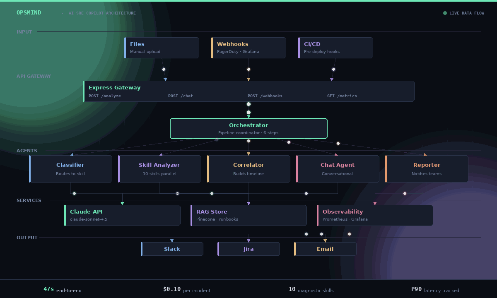

# PerfAgent / OpsMind

**AI-Powered SRE Copilot Platform** — autonomously triages production incidents across Oracle, JVM, frontend, and Kubernetes diagnostics in 30 seconds instead of hours.



---

## What it does

Paste 5 diagnostic files (AWR report, thread dump, heap dump, SQL, browser log). 30 seconds later, get:

- Per-file findings with severity, evidence, root cause, recommendations
- Cross-artifact incident timeline showing the causal chain
- Routed notifications to the right team (Slack, Jira, email)
- Conversational chat to ask follow-up questions
- RAG-augmented analysis citing your team''s runbooks

**5,000x cost reduction** vs manual triage. **200x faster.** $0.10 per incident in API costs vs. ~$500 in senior engineer time.

---

## The 10 diagnostic skills

| Skill | Detects |
|---|---|
| AWR | Oracle wait events, top SQL, memory sizing |
| SQL Monitor | Execution plan steps, cardinality estimates |
| SQL Tuning | Cartesian joins, non-SARGable predicates, missing indexes |
| Thread Dump | Deadlocks, BLOCKED threads, pool exhaustion |
| Heap Dump | Memory leaks, retained heap, OOM patterns |
| JFR | CPU hotspots, GC overhead, lock contention |
| UI Console | JS errors, slow requests, Core Web Vitals |
| Stack Trace | Innermost Caused-By across any language |
| JMeter | P90/P99 regression, error rate, owner routing |
| **Kubernetes** | OOMKilled, CrashLoopBackOff, HPA, scheduling |

---

## Run the demo locally

```bash
node server.js
# Open http://localhost:3737
```

Paste your Anthropic API key, browse files from `sample-files/`, click **🚀 Analyze All Files & Build Incident Timeline**.

After correlation completes, the **💬 Chat** tab appears for follow-up questions.

---

## Architecture

The animated GIF above shows the data flow through 6 layers: inputs → API gateway → orchestrator → 5 specialized agents → external services (Claude/RAG/observability) → outputs (Slack/Jira/email).

- [`docs/PerfAgent_Architecture_v2.png`](docs/PerfAgent_Architecture_v2.png) — static architecture diagram with all 7 layers
- [`docs/PerfAgent_OpsMind_Process.docx`](docs/PerfAgent_OpsMind_Process.docx) — full 11-section build documentation
- [`docs/PerfAgent_Evolution.gif`](docs/PerfAgent_Evolution.gif) — animated v1 → v2 evolution

---

## Production version

This repo is the **standalone Node.js demo** with zero dependencies — perfect for quickly evaluating the approach.

The full production version with **Pinecone RAG**, **Prometheus metrics**, **Grafana dashboards**, **Docker**, and **AWS ECS** deployment lives at: [github.com/srimtipparaju-ux/perfagent](https://github.com/srimtipparaju-ux/perfagent)

---

## Tech stack

- **Runtime:** Node.js, TypeScript
- **AI:** Anthropic Claude (claude-sonnet-4-5)
- **Vector DB:** Pinecone (production) / in-memory TF-IDF (demo)
- **Observability:** Prometheus + Grafana
- **Deployment:** Docker, AWS ECS Fargate, Vercel

---

## Author

**Sri Tipparaju** — Cloud Database Engineer, 13 years experience.
Portfolio: [sri-m-tipparaju-cloud.vercel.app](https://sri-m-tipparaju-cloud.vercel.app)
